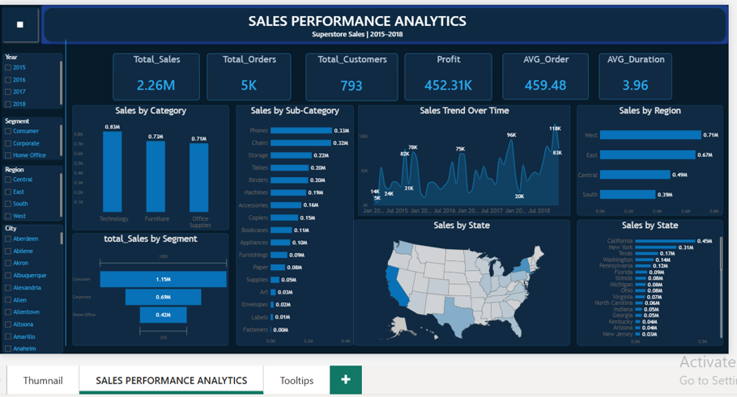

# 📊 Sales Performance Analytics (Superstore Sales)

## 📌 Project Overview
An interactive Power BI dashboard designed to analyze Superstore Sales performance from 2015 to 2018. It provides deep business insights into revenue trends, order volume, customer metrics, and regional/category profitability.

---

## 📸 Dashboard Preview

---

## 🔑 Key Metrics & Insights
- *Total Sales:* $2.26M
- *Total Orders:* 5K
- *Total Customers:* 793
- *Total Profit:* $452.31K
- *Average Order Value:* $459.48

---

## 🛠️ Tools Used
- *Power BI:* Data Visualization, DAX, and Interactive Dashboard Design.
- *Excel / CSV:* Data Cleaning and Preparation.
-
